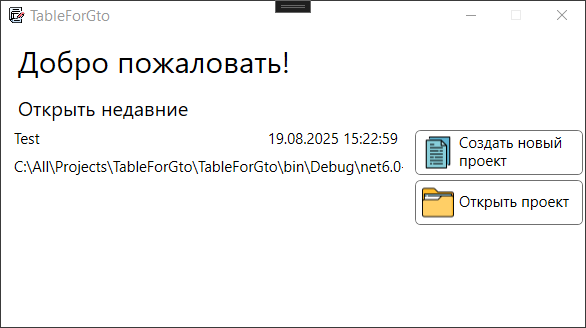
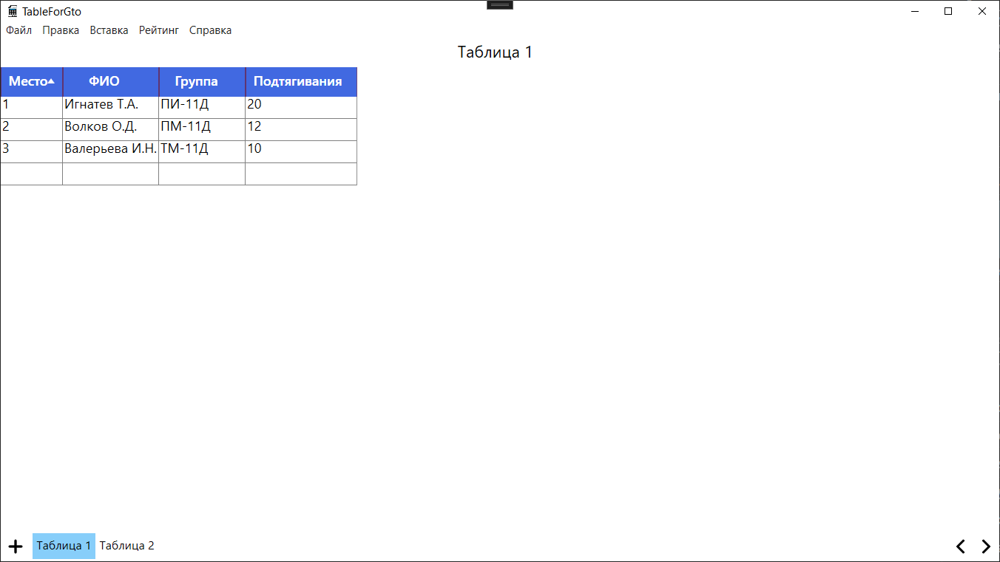

# Описание проекта

**TableForGto** — это приложение для создания и управления таблицами с рейтингами. Оно позволяет пользователям создавать проекты, добавлять в них таблицы, настраивать структуру таблиц и автоматически рассчитывать рейтинги на основе числовых данных и времени.

## Основные возможности

- **Создание и выбор проектов**: при запуске программы пользователь попадает на экран, где может создать новый проект или открыть уже существующий.
- **Работа с таблицами**:
  - По умолчанию каждая таблица содержит три столбца: *Место*, *ФИО* и *Группа*.
  - Пользователь может добавлять дополнительные столбцы следующих типов: числовой, строка, дата и время.
- **Расчёт рейтинга**:
  - Рейтинг рассчитывается на основе числовых столбцов и столбцов с временем.
  - Для запуска расчёта необходимо выбрать в меню: **Рейтинг → Составить** или нажать клавишу **F5**.
- **Редактирование данных**:
  - Поддерживаются стандартные операции: копирование, вставка, вырезка.
- **Множественные таблицы**:
  - В одном проекте можно создать несколько таблиц.
- **Справочная система**:
  - В приложении доступна встроенная справка.

## Скриншоты

### Окно создания/выбора проектов

### Главное окно приложения
